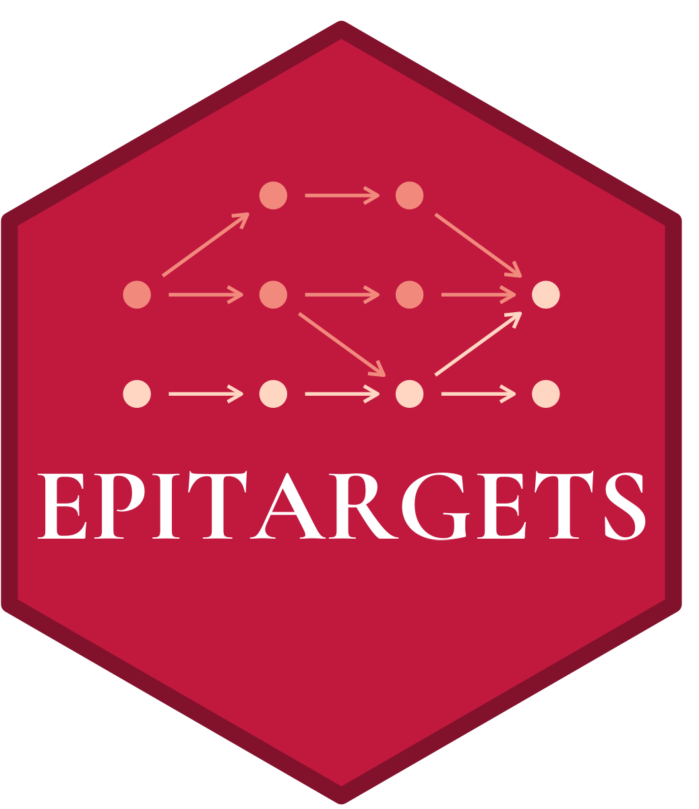

<!-- README.md is generated from README.Rmd. Please edit that file -->

```{r, include = FALSE}
knitr::opts_chunk$set(
  collapse = TRUE,
  comment = "#>",
  fig.path = "man/figures/README-",
  out.width = "100%"
)
```

# epitargets <a href="https://economic.github.io/epitargets/"></a>

<!-- badges: start -->
<!-- badges: end -->

epitargets extends the [{targets}](https://docs.ropensci.org/targets/) pipeline framework with automatic date-tracking and age-based cues, and other convenience functions.

## Installation

``` r
install.packages(
   "epitargets",
   repos = c("https://economic.r-universe.dev", getOption("repos"))
)
```

## Usage

```{r}
library(epitargets)
```

### Track when targets were last built

`tar_target_date()` is a drop-in replacement for `targets::tar_target()`. It creates your target plus a companion `_date` target that records when it ran:

```{r}
targets::tar_dir({
  targets::tar_script({
    library(epitargets)
    list(
      tar_target_date(wages, data.frame(year = 2020:2024, wage = c(15, 15, 16, 17, 18)))
    )
  })
  targets::tar_make()
  print(targets::tar_read(wages))
  print(targets::tar_read(wages_date))
})
```

### Auto-refresh targets on a schedule

`tar_age_date()` adds an age-based cue so the target automatically re-runs after a time period. Useful for API calls or any data that goes stale:

```{r}
targets::tar_dir({
  targets::tar_script({
    library(epitargets)
    list(
      tar_age_date(daily_data, Sys.time(), age = as.difftime(1, units = "days"))
    )
  })
  targets::tar_make()
  print(targets::tar_read(daily_data))
  print(targets::tar_read(daily_data_date))
})
```

### Summarize freshness across targets

`collect_target_date()` gathers `_date` targets into a single tibble so you can see at a glance when each target last ran:

```{r}
targets::tar_dir({
  targets::tar_script({
    library(epitargets)
    list(
      tar_target_date(wages, data.frame(wage = 18)),
      tar_age_date(prices, data.frame(price = 3.50)),
      targets::tar_target(freshness, collect_target_date(wages_date, prices_date))
    )
  })
  targets::tar_make()
  targets::tar_read(freshness)
})
```

### Read a target and keep a handle to it

`tar_read_stash()` reads a target and, besides returning it, leaves a copy in the global environment as `.target` so you can keep exploring it without re-running the read:

```r
tar_read_stash(wages)
.target |> dplyr::filter(year == 2024)
```

It really shines as an RStudio/Positron addin. Put the cursor on a target name in `_targets.R` or an analysis script and trigger the **"Stash target under cursor"** addin (bind it to a keyboard shortcut, just like `targets::rstudio_addin_tar_read()`). The value prints to the console and lands in `.target`.

The addin extracts the symbol under the cursor with [`atcursor`](https://github.com/MilesMcBain/atcursor), an optional dependency. If it isn't installed the addin will offer to install it for you from its r-universe repository.
